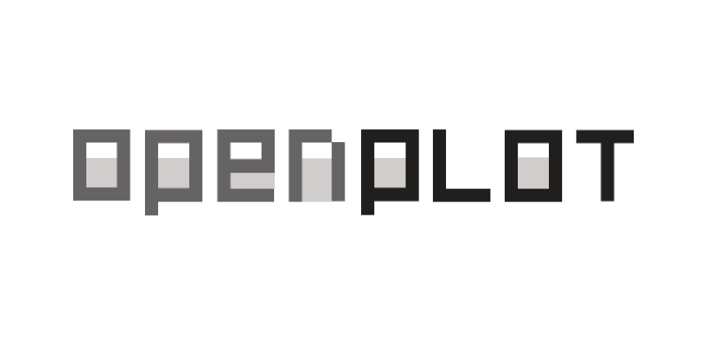
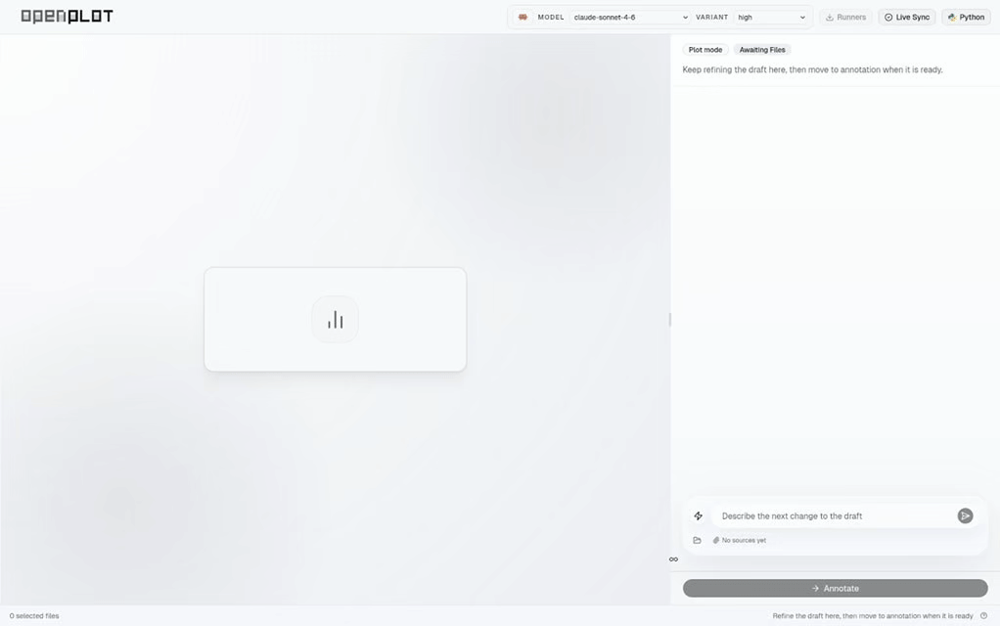
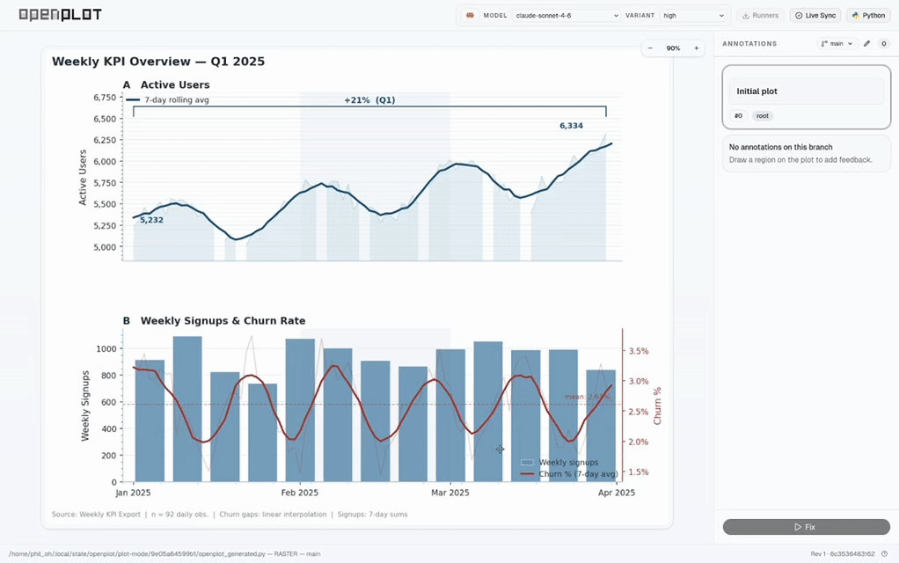

<p align="center">
  
</p>

<p align="center"><strong>The agentic plotting "IDE" built for everyone </strong></p>

<p align="center">
  
  
  
</p>

---

Agentic coding already makes plotting easier: give your data to an agent, and it can write a script for you in seconds.
But **getting a plot** is not the same as **getting a _good_ plot**.
That first draft is usually not presentation-ready. Quite often, _it just looks bad_.

So you spend the next 30 minutes telling the agent exactly what to change. Move the legend. Fix the labels. Soften the colours. Tighten the spacing. After a few rounds you finally feel like you are getting close -- and then comes **another 30 minutes of tiny adjustments**. Worse, sometimes you know _exactly_ what feels wrong, but cannot describe it clearly enough for the agent to act on it. You end up writing 100 words just to point at one awkward corner of the figure.

**OpenPlot is built for that part.**
It is an agentic plotting IDE that lets you stay in control **without babysitting the whole process**. Connect your favourite coding agent -- Codex, Claude Code, or OpenCode -- and let it inspect the data, choose the right visualisation, and handle styling, colour, layout, and positioning for you. In **Auto mode**, agents can review their own drafts and keep refining through multiple passes.
OpenPlot turns painful prompting into a much simpler decision-making workflow: choose your data file, confirm a few design options, switch on **Auto mode**, and go make your coffee.

<table align="center">
  <tr>
    <td align="center" width="50%">
      <br />
      <sub>Pick the data files you want the agent to work with.</sub>
    </td>
    <td align="center" width="50%">
      <br />
      <sub>Confirm the deisgn choices and start plotting.</sub>
    </td>
  </tr>
</table>

And when the result is _98% right_ but still not quite there, OpenPlot's **drag-and-select annotation mode** makes the last mile easy. Just point to the exact region you want fixed and describe the change in simple, lazy language. **No prompt engineering.** No carefully crafted essay. Just direct instruction.

<table align="center">
  <tr>
    <td align="center" width="50%">
      <br />
      <sub>Drag-select the exact region you want changed.</sub>
    </td>
    <td align="center" width="50%">
      <br />
      <sub>Watch live output from the agent addressing your comment.</sub>
    </td>
  </tr>
</table>

If you want to explore multiple directions, OpenPlot makes that easy too. Click any previous step, make any new annotation to branch from it, and try a different adjustment path in parallel. OpenPlot gives you **git-like version control for plots**: switch between branches, compare outcomes, and download both the final image _and_ the directly runnable Python script behind it.

OpenPlot also ships with a **built-in Python runtime** and popular data visualisation libraries. Need more? Configure your own environment.

We want OpenPlot to be **truly for everyone**.

## Features

**Plot Mode** -- Generate plots from local data files through an AI chat interface. Select file paths, preview supported tabular sources, confirm target ranges when needed, approve a plan, and let the agent produce a plotting script autonomously.

**Annotation Mode** -- Draw and select regions on rendered plot, attach lazy instruction, and let a coding agent fix it precisely.

**Feedback Compiler** -- Annotations are turned into structured LLM prompts with scope rules (local region vs. local element) so the model knows exactly what to change.

**MCP Server** -- Built-in MCP bridge for agent integration via `openplot mcp`, with automatic wiring for supported runners.

**Multi-Runner Support** -- Connect with your favourite agents [OpenCode](https://opencode.ai), [Codex](https://github.com/openai/codex), or [Claude Code](https://docs.anthropic.com/en/docs/agents-and-tools/claude-code/overview) as the fixing agent, with per-runner model and variant selection.

**Version Control** -- Every fix creates a new version with immutable script and plot snapshots. Supports undo and branching to compare between versions.

**Background Fix Jobs** -- Kick off repeated fix iterations from the UI and watch live runner output until all pending annotations are addressed.

**Desktop App** -- Native desktop app via pywebview on macOS and Windows.

**Data Privacy** -- OpenPlot keeps scripts, plots, and session state on your machine. Remote network usage depends on the coding runner and model you connect.

**Data Profiling** -- Auto-detects table regions in tabular data, shows previews with integrity notes, and supports multi-sheet Excel workbooks.

## Roadmap

- [ ] Support bring-your-own API key
- [ ] Plugin for jupyter lab
- [ ] Integrate with NanoBanana

## Installation

### Prerequisites

OpenPlot needs a coding agent CLI to generate and fix plots. You must have **at least one** of the following installed:

| Agent       | Install guide                                                                                    |
| ----------- | ------------------------------------------------------------------------------------------------ |
| OpenCode    | [docs](https://opencode.ai)                                                                      |
| Codex       | [docs](https://chatgpt.com/codex)                                                                |
| Claude Code | [docs](https://docs.anthropic.com/en/docs/agents-and-tools/claude-code/overview#getting-started) |

> **macOS desktop app users:** The `.dmg` build bundles a one-click installer for coding agents, so you can skip this step and set up an agent from within the app.

### Pre-Built Binaries

Current GitHub release artifacts are available from [GitHub Releases](https://github.com/phira-ai/OpenPlot/releases):

| Platform               | Artifact                   |
| ---------------------- | -------------------------- |
| macOS (M-chip) (arm64) | `OpenPlot-arm64.dmg`       |
| Windows (x64)          | `OpenPlot-windows-x64.zip` |

Linux users can build from source or use the Nix flake.

### From PyPI

```bash
pip install openplot
```

To include desktop app dependencies (pywebview):

```bash
pip install "openplot[desktop]"
```

### From Source

**Prerequisites:** Python 3.12+, [uv](https://docs.astral.sh/uv/), Node.js + npm

```bash
git clone https://github.com/phira-ai/OpenPlot.git
cd OpenPlot
uv sync
npm ci --prefix frontend
npm run build --prefix frontend
```

To include desktop app dependencies (pywebview):

```bash
uv sync --extra desktop
```

To include development tools (ruff, pytest):

```bash
uv sync --group dev
```

### Nix Flake

```bash
# Run directly
nix run github:phira-ai/OpenPlot#openplot -- serve examples/test_plot.py

# Run the desktop launcher
nix run github:phira-ai/OpenPlot#openplot-desktop

# Build the package
nix build github:phira-ai/OpenPlot#openplot
```

Use as a flake input:

```nix
{
  inputs.openplot.url = "github:phira-ai/OpenPlot";
}
```

and

```nix
  environment.systemPackages = with pkgs; [
    inputs.openplot.packages.${pkgs.stdenv.hostPlatform.system}.openplot
    inputs.openplot.packages.${pkgs.stdenv.hostPlatform.system}.openplot-desktop
  ];
```

## Architecture

```
┌─────────────────────────────────────────────────────┐
│                    Web UI (React)                   │
│  Plot Viewer  ·  Annotation Overlay  ·  Chat Panel  │
└──────────────────────┬──────────────────────────────┘
                       │ REST + WebSocket
┌──────────────────────▼──────────────────────────────┐
│                FastAPI Backend (Python)             │
│  Script Executor · Feedback Compiler · Session Mgr  │
│  Version Control · Data Profiler · Fix Job Runner   │
└──────────┬────────────────────────────┬─────────────┘
           │ stdio (MCP)                │ subprocess
┌──────────▼───────────┐    ┌───────────▼─────────────┐
│     Coding Agent     │    │   Python Interpreter    │
│ (OpenCode / Codex /  │    │  (matplotlib, seaborn,  │
│   Claude Code)       │    │   numpy, pandas, ...)   │
└──────────────────────┘    └─────────────────────────┘
```

1. The **React frontend** renders plots and captures region annotations.
2. The **FastAPI backend** compiles annotations into structured prompts, executes scripts, manages versioned state, and serves everything over REST and WebSocket.
3. The **MCP server** bridges the backend to coding agents over stdio, enabling a closed feedback loop: annotate, fix, re-render, repeat.

<details>
<summary><strong>CLI Reference</strong></summary>

### `openplot serve`

Start the OpenPlot backend/UI server and open the browser by default.

```
openplot serve [FILE] [OPTIONS]
```

| Option         | Default     | Description                          |
| -------------- | ----------- | ------------------------------------ |
| `FILE`         | _(none)_    | Python script (`.py`)                |
| `--port`       | `17623`     | Server port (`0` for auto-pick)      |
| `--host`       | `127.0.0.1` | Bind address                         |
| `--no-browser` | off         | Don't open the browser automatically |

When `FILE` is omitted, OpenPlot restores the most recently updated workspace. If no workspace exists, it launches in plot mode.

### `openplot desktop`

Launch the native desktop window.

```
openplot desktop [FILE] [OPTIONS]
```

Accepts the same `.py` `FILE` input and the same options as `serve` except `--no-browser`.

### `openplot mcp`

Start the MCP stdio bridge for agent integration.

```
openplot mcp [OPTIONS]
```

| Option         | Default             | Description          |
| -------------- | ------------------- | -------------------- |
| `--server-url` | _(auto-discovered)_ | OpenPlot backend URL |

Server URL discovery priority: `--server-url` > `OPENPLOT_SERVER_URL` > `~/.openplot/port`.

`openplot serve` does not launch the MCP stdio bridge itself; it writes the discovery port file used by `openplot mcp`. In normal OpenPlot runner flows, supported agents launch `openplot mcp` automatically when they need MCP access.

</details>

<details>
<summary><strong>Configuration</strong></summary>

### Environment Variables

| Variable                  | Description                                               |
| ------------------------- | --------------------------------------------------------- |
| `OPENPLOT_STATE_DIR`      | Override the runtime state/artifacts root                 |
| `OPENPLOT_SERVER_URL`     | MCP only: override the backend URL used by `openplot mcp` |
| `OPENPLOT_SESSION_ID`     | MCP only: target a specific session in MCP calls          |
| `OPENPLOT_BUILTIN_PYTHON` | Advanced: override the built-in Python interpreter path   |

Selected data files stay at their original paths; OpenPlot no longer copies them into an app-managed data store.

### State Storage Paths

| Platform | State                                           |
| -------- | ----------------------------------------------- |
| macOS    | `~/Library/Application Support/OpenPlot/state/` |
| Linux    | `~/.local/state/openplot/`                      |
| Windows  | `%LOCALAPPDATA%/OpenPlot/state/`                |

</details>

## Contributing

Contributions are welcome. To get started:

```bash
# Clone and install with dev dependencies
git clone https://github.com/phira-ai/OpenPlot.git
cd OpenPlot
uv sync --group dev

# Install frontend dependencies
npm ci --prefix frontend

# Run backend checks
uv run pytest
uv run ruff check src tests

# Run frontend checks
npm run test --prefix frontend
npm run lint --prefix frontend

# Build frontend (includes TypeScript build)
npm run build --prefix frontend
```

Please open an issue before submitting large changes.

## License

This project is licensed under the [GNU General Public License v3.0](LICENSE).
